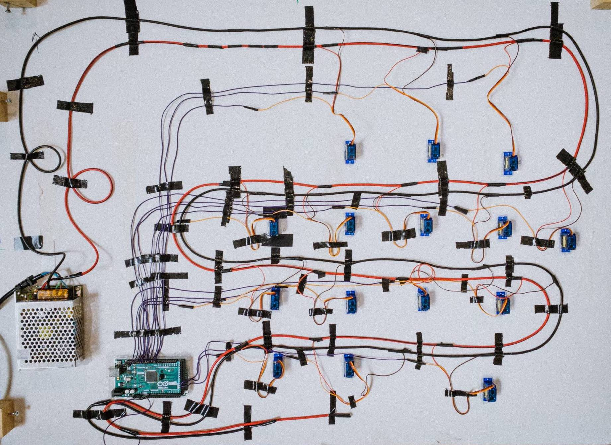

# Interactive War Rug at Matadero Media Lab

## Technical Description
Code for 15 SG90 servo motors connected to a rug. Each motor is moving a small disc with a piece of rug on it. The code is run on an Arduino Mega.

// PROJECT DESCRIPTION
 
[Project Website]()
 

